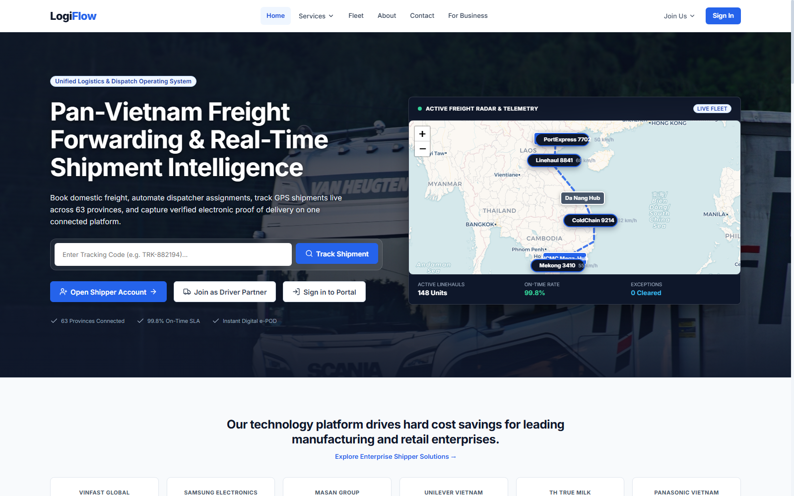
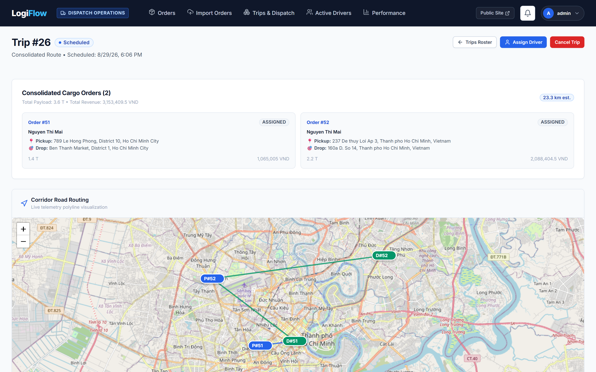
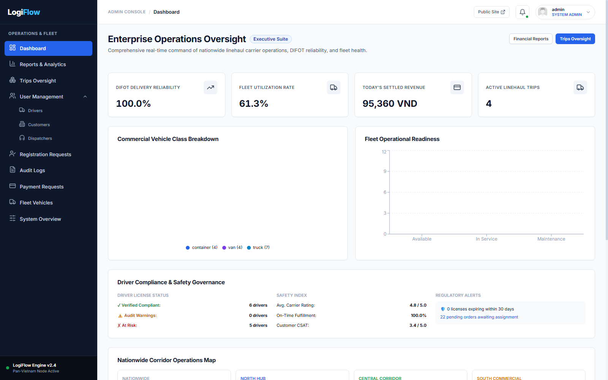
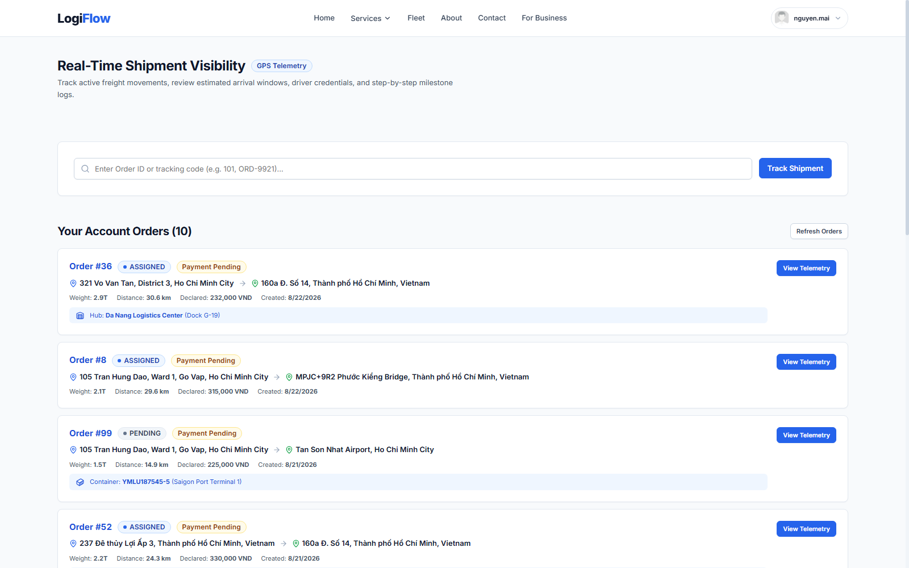
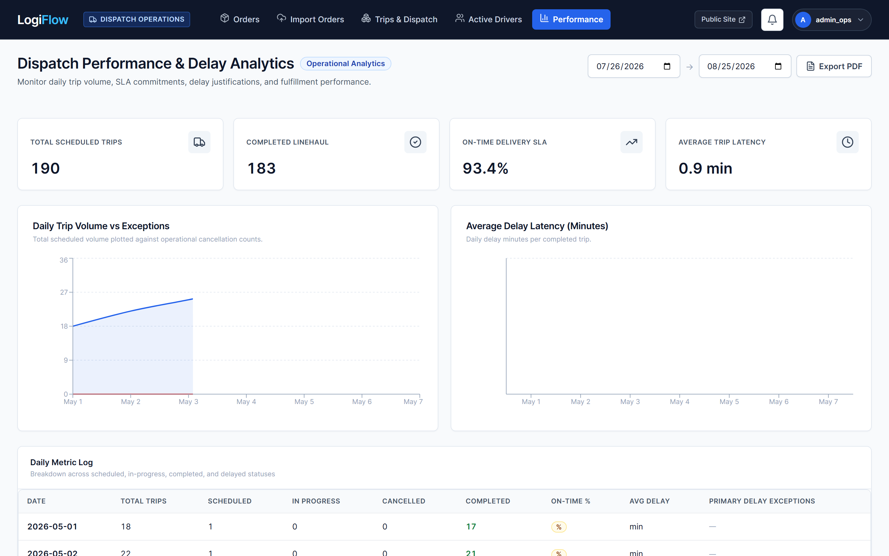
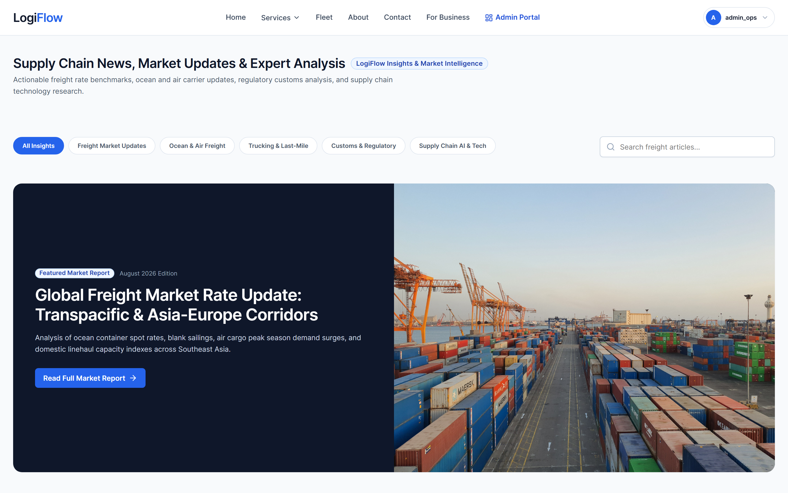

<p align="center">
  
</p>

<p align="center">
  <strong>An academic freight-management application with multi-role workflows, WebSocket driver-location updates, React/Leaflet maps, and a Flutter driver client.</strong>
</p>

<p align="center">
  <a href="https://logiflow-client.onrender.com"></a>
  
  
  
  
  
  
  
</p>

---

> **Project scope:** LogiFlow is a portfolio and academic project, not a live freight carrier. PayPal runs in sandbox mode, license OCR extracts fields for human review, and sample coverage, contacts, and operational data are demonstrations rather than commercial commitments.

## Platform Visual Preview

| Landing Page & Operations Dashboard | Driver Locations & Route Map |
|:---:|:---:|
|  |  |
| **Operations Management Dashboard** | **Public Shipment Tracking & Telemetry** |
|  |  |
| **Performance & Delay Reports** | **Sample Logistics News Feed** |
|  |  |

---

## DevOps & Infrastructure

LogiFlow is orchestrated with Docker Compose locally. GitHub Actions validates every component and publishes production container images to GitHub Container Registry after a successful build on `main`.

### End-to-End Architecture

```text
React 19 Web App (Admin / Dispatcher)        Flutter Mobile App (Driver GPS)
                 │                                           │
                 │ HTTPS / REST & WSS / STOMP                │ HTTPS / WSS
                 ▼                                           ▼
+─────────────────────────────────────────────────────────────────────────────+
|                            SPRING BOOT 3 BACKEND                            |
|                                                                             |
|  ├─ Security & Auth       ──► JWT Bearer Auth & Multi-Role RBAC             |
|  ├─ Dispatch Engine       ──► Trip State Machine & Driver Assignment        |
|  ├─ Real-Time Telemetry   ──► STOMP WebSockets & Live GPS Streaming         |
|  ├─ Proof of Delivery     ──► Digital Signature Capture & Photo Upload      |
|  └─ Billing Demo          ──► PayPal Sandbox & PDF Invoices                 |
+─────────────────────────────────────────────────────────────────────────────+
                 │                                           │
                 ▼                                           ▼
PostgreSQL 15                                   External APIs (PayPal, Cloudinary)
```

### Services

| Service | Technology | Role |
|---|---|---|
| Backend API | Spring Boot 3 + Java 21 | RESTful endpoints, WebSocket broker, security, business logic |
| Web Client | React 19 + Ant Design | Dispatcher command console, tracking portal, analytics |
| Mobile Client | Flutter (Dart) | Driver turn-by-turn tracking, signature capture, status updates |
| Database | PostgreSQL 15 | Relational storage for users, orders, trips, and telemetry |
| Telemetry Broker | Spring STOMP / WebSockets | Trip-scoped driver-location updates |
| Containerization | Docker + Docker Compose | Multi-service orchestration (`compose.yaml`) |

### Implementation Notes

- **Map-based Routing** — Geocoding and routing data are displayed in Leaflet/OpenStreetMap views.
- **STOMP Location Updates** — Drivers publish location updates over WebSockets and web clients subscribe by trip.
- **Role-Based Workflows** — Spring Security restricts endpoints by role while service code handles trip-state transitions.
- **Invoices and Sandbox Payments** — Thymeleaf/iText generates PDFs and the PayPal sandbox demonstrates checkout and capture flows.

---

## Features

- **Driver Location Updates**: Trip-scoped coordinates are sent over WebSockets and displayed on Leaflet maps.
- **Multi-Role Coordination**: Tailored portals for Admins (fleet config), Dispatchers (trip routing), Drivers (POD execution), and Customers (public tracking).
- **Proof of Delivery (POD)**: On-glass digital signature capture and delivery photo uploads.
- **Rule-Based Driver Recommendations**: Scores drivers using availability, license category, current location, and vehicle capacity.
- **License Data Extraction**: Uses Mistral OCR to prefill fields from a driver-license image for human review.
- **Invoices and Sandbox Checkout**: Generates PDF invoices and integrates PayPal sandbox checkout.
- **Delivery-Target & Delay Analytics**: Demonstration dashboards for transit times, on-time rates, and delay alerts.

---

## Tech Stack

- **Backend**: Spring Boot 3, Java 21, Spring Security, Spring Data JPA
- **Web Frontend**: React 19, Vite, Ant Design, Leaflet, SockJS, StompJS
- **Mobile Application**: Flutter, Dart, Google Maps / OpenStreetMap SDK
- **Database**: PostgreSQL 15
- **Infrastructure**: Docker, Docker Compose, GitHub Actions CI/CD, GitHub Container Registry

---

## Getting Started

### 1. Clone repository & configure environment

```bash
git clone https://github.com/ttnhan227/logiflow.git
cd logiflow
cp .env.docker.example .env
```

### 2. Start with Docker Compose

```bash
docker compose up -d --build
```

| Endpoint | URL |
|---|---|
| Dispatcher & Customer Web App | http://localhost:5173 |
| Flutter Web Client | http://localhost:8085 |
| Spring Boot Backend API | http://localhost:8080/api |
| Swagger API Documentation | http://localhost:8080/swagger-ui.html |
| Backend Health | http://localhost:8080/actuator/health |

---

## Environment Variables Reference

| Variable | Description | Default / Example |
|---|---|---|
| `DATABASE_URL` | PostgreSQL JDBC URL used by the backend | `jdbc:postgresql://database:5432/logiflow` |
| `DATABASE_USERNAME` | Database user | `logiflow` |
| `DATABASE_PASSWORD` | Database password | Local value from `.env` |
| `JWT_SECRET` | Secret key for HS256 JWT access tokens | `min-32-chars-secret-key-for-jwt` |
| `JPA_DDL_AUTO` | Hibernate schema policy (`update` locally, `validate` in production) | `update` |
| `APP_SEED_ENABLED` | Load local demonstration data | `true` locally; `false` by default in the application |
| `VITE_API_BASE_URL` | Web API URL compiled into the React bundle | `/api` |
| `MOBILE_API_BASE_URL` | API URL compiled into the Flutter web bundle | `/api` |
| `APP_WEB_BASE_URL` | Public web origin used in customer emails | `http://localhost:5173` |
| `MAIL_HEALTH_ENABLED` | Include SMTP connectivity in API health status | `false` |
| `PAYPAL_CLIENT_ID` | PayPal Sandbox Client ID | `sandbox_client_id` |
| `PAYPAL_CLIENT_SECRET` | PayPal Sandbox Secret Key | `sandbox_secret_key` |
| `CLOUDINARY_CLOUD_NAME` | Cloudinary account name for uploaded files | Optional |

The Compose defaults are intended for local development. For production, use a generated database password and JWT secret, set `APP_SEED_ENABLED=false`, and manage schema migrations separately with `JPA_DDL_AUTO=validate`.

---

## Testing & Quality Assurance

```bash
# Run backend JUnit & Mockito test suites
cd server
./mvnw test

# Run frontend checks
cd ../client
npm ci
npm run lint
npm run build

# Run mobile checks (requires Flutter 3.47.5)
cd ../client_mobile
flutter pub get
flutter analyze
flutter test
```

## CI/CD

- `.github/workflows/ci.yml` runs backend tests, frontend lint/build, Flutter analyze/test/build, the full-stack Playwright suite against Compose, and builds all three container images.
- `.github/workflows/cd.yml` publishes backend, frontend, and Flutter web images to GHCR after CI succeeds on `main`. Images receive both `latest` and commit-SHA tags and include provenance and SBOM attestations.
- `.github/dependabot.yml` checks Maven, npm, Docker, and GitHub Actions dependencies weekly.

---

## License

MIT
